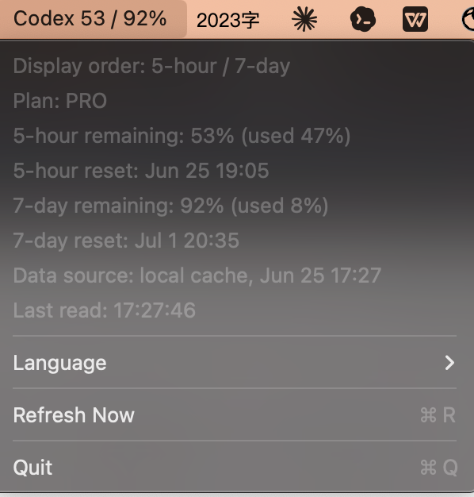

# CodexVisual

<p align="center">
  
</p>

## English

CodexVisual is a lightweight macOS menu bar app for checking your remaining Codex quota at a glance.

It focuses on one thing: showing the remaining 5-hour quota and 7-day quota in the menu bar.

```text
Codex 67 / 95%
```

The first number is the remaining 5-hour quota. The second number is the remaining 7-day quota.

### Download

[Download CodexVisual.dmg](https://github.com/orangeshushu/CodexVisual/releases/latest/download/CodexVisual.dmg)

Open `CodexVisual.dmg`, then double-click `CodexVisual.pkg` and follow the macOS Installer prompts.

### Features

- Shows Codex quota directly in the macOS menu bar.
- Uses the compact `Codex 67 / 95%` format for easier scanning.
- Shows the next reset time inside the 5-hour and 7-day quota cards.
- Provides a standalone control window with Refresh, Check for Updates, Uninstall, and Quit.
- Shows menu details in English or Chinese, with a manual language selector.
- Reads the latest local `codex.rate_limits` event from Codex log databases, including `~/.codex/logs_2.sqlite` and `~/.codex/sqlite/logs_2.sqlite`.
- Lets you choose the refresh frequency: Smart, every 5 seconds, every 15 seconds, every 60 seconds, every 5 minutes, or Manual.
- Includes Check for Updates, which can download, verify, install, and reopen the latest signed DMG.
- Includes an in-app uninstall action for Developer ID installs.
- Does not call external APIs while reading quota and does not read `auth.json`.
- Includes scripts for building, installing, uninstalling, and creating a DMG package.

### English Menu

<p align="center">
  
</p>

### Why CodexVisual

CodexVisual is intentionally small and focused. Compared with [steipete/CodexBar](https://github.com/steipete/CodexBar), CodexVisual is lighter and only targets Codex quota visibility.

### Data Freshness

CodexVisual is not using an official live quota API. It refreshes by polling local Codex log events and keeps showing the latest cached reading if Codex has not recently emitted a new `codex.rate_limits` event.

The default refresh mode is Smart. In Smart mode, CodexVisual checks local logs every 15 seconds, and if a quota reset time is closer than that, it schedules the next read just after the reset time. For lower resource usage, choose every 60 seconds, every 5 minutes, or Manual from the Refresh Frequency menu.

### Accounts and Quotas

CodexVisual reads current quota events from the local Codex log database. If you sign in to Codex with a different account, the displayed quota changes only after that account writes a fresh, unexpired `codex.rate_limits` event. Stale quota events and stale cache entries are ignored so the app does not show another account's old quota as if it were current.

### Troubleshooting

If the menu bar shows `Codex -- / --%`, open Codex once from the account you want to monitor and send a message so Codex can write a fresh quota event. Then click CodexVisual in the menu bar and choose `Refresh Now`.

If the menu bar item appears but does not open when clicked, install CodexVisual 1.0.8 or newer. Version 1.0.8 adds a standalone control window, so you can open `CodexVisual.app` from Applications to refresh, update, quit, or uninstall even when the menu bar item is blocked by a menu bar manager or display setup.

### Resource Usage

CodexVisual is a small AppKit menu bar app. In normal use it sleeps between timer ticks, reads local SQLite logs, updates the menu bar text, and does not keep network connections open.

Network access is only used when you click `Check for Updates`. The updater downloads the latest DMG, asks macOS Gatekeeper to verify it, installs it into `~/Applications`, and reopens CodexVisual.

### Build

```bash
./scripts/build_app.sh
```

The app will be generated at:

```text
build/CodexVisual.app
```

### Run

```bash
open build/CodexVisual.app
```

Click the menu bar item to see quota cards, reset times, the selected refresh mode, and the latest local reading time. You can also open `CodexVisual.app` from Applications to show the control window.

### Install, Update, Uninstall, and DMG

Download the latest DMG directly: [CodexVisual.dmg](https://github.com/orangeshushu/CodexVisual/releases/latest/download/CodexVisual.dmg).

Create a macOS DMG package. The DMG contains a standard macOS Installer package instead of a drag-to-Applications layout:

```bash
./scripts/create_dmg.sh
```

The DMG will be generated at:

```text
build/CodexVisual.dmg
```

For a public release that opens normally on other Macs, build the app and installer with Developer ID certificates, then notarize the DMG:

```bash
CODE_SIGN_IDENTITY="Developer ID Application: Your Name (TEAMID)" \
PKG_SIGN_IDENTITY="Developer ID Installer: Your Name (TEAMID)" \
./scripts/create_dmg.sh

NOTARY_PROFILE=codexvisual-notary ./scripts/notarize_dmg.sh

spctl -a -vv -t install build/CodexVisual.dmg
```

Create the notarization profile once with:

```bash
xcrun notarytool store-credentials codexvisual-notary --apple-id you@example.com --team-id TEAMID --password xxxx-xxxx-xxxx-xxxx
```

The public GitHub release should upload the stapled `build/CodexVisual.dmg`.

Install or uninstall directly:

```bash
./scripts/install.sh
./scripts/uninstall.sh
```

The installer installs the app to `/Applications/CodexVisual.app` and opens it after installation. You can uninstall from the CodexVisual control window, or run `./scripts/uninstall.sh`. Uninstalling stops the menu bar process and removes the app plus cached data under `~/Library/Application Support/CodexVisual`; it also removes legacy `CodexQuotaBar` paths if present.

Launchpad long-press uninstall is not expected to work for this kind of Developer ID DMG app. Use the in-app uninstall action or `./scripts/uninstall.sh`.

---

## 中文

CodexVisual 是一个轻量的 macOS 菜单栏小程序，用来快速查看 Codex 额度还剩多少。

它只专注一件事：在菜单栏显示 Codex 的 5 小时额度和 7 天额度剩余百分比。

```text
Codex 67 / 95%
```

第一个数字是 5 小时额度剩余，第二个数字是 7 天额度剩余。

### 下载

[下载 CodexVisual.dmg](https://github.com/orangeshushu/CodexVisual/releases/latest/download/CodexVisual.dmg)

打开 `CodexVisual.dmg` 后，双击 `CodexVisual.pkg`，并按照 macOS 安装器提示完成安装。

### 功能

- 在 macOS 菜单栏直接显示 Codex 额度。
- 使用更容易扫读的 `Codex 67 / 95%` 格式。
- 在 5 小时和 7 天额度卡片中显示下一次刷新/重置时间。
- 提供独立控制窗口，包含刷新、检查更新、卸载和退出。
- 菜单详情支持英文和中文，并提供手动语言选择。
- 从 Codex 本地日志数据库读取最新的 `codex.rate_limits` 事件，包括 `~/.codex/logs_2.sqlite` 和 `~/.codex/sqlite/logs_2.sqlite`。
- 可以选择刷新频率：智能、每 5 秒、每 15 秒、每 60 秒、每 5 分钟、手动。
- 提供“检查更新”，可以自动下载、校验、安装并重新打开最新版签名 DMG。
- 提供 App 内卸载入口，适合 Developer ID DMG 安装方式。
- 读取额度时不访问外网，也不读取 `auth.json`。
- 提供构建、安装、卸载和 DMG 打包脚本。

### 为什么叫 CodexVisual

CodexVisual 是一个更轻量、更单一用途的菜单栏工具。相比 [steipete/CodexBar](https://github.com/steipete/CodexBar)，CodexVisual 只针对 Codex 的本地额度状态展示，不做额外的工作流管理。

### 数据刷新

CodexVisual 不是通过官方实时额度 API 获取数据。它通过读取本地 Codex 日志来刷新数据。如果 Codex 最近没有写入新的 `codex.rate_limits` 事件，应用会继续显示最近一次缓存到的额度数据。

默认刷新模式是“智能”。在智能模式下，CodexVisual 平时每 15 秒读取一次本地日志；如果检测到额度刷新时间已经很近，会把下一次读取安排在刷新时间刚过之后。想进一步降低资源占用，可以在“刷新频率”中选择每 60 秒、每 5 分钟或手动。

### 账号和额度

CodexVisual 读取的是本地 Codex 日志中的当前额度事件。如果你在 Codex 中切换到另一个账号，上面的额度会在该账号写入新的、未过期的 `codex.rate_limits` 事件后随之变化。过期额度事件和过期缓存会被忽略，避免把其它账号的旧额度当成当前额度显示。

### 排查

如果菜单栏显示 `Codex -- / --%`，先用你想监控的账号打开 Codex 并发送一条消息，让 Codex 写入新的额度事件。然后点击菜单栏里的 CodexVisual，选择“立即刷新”。

如果菜单栏项目已经显示，但点击后打不开菜单，请安装 CodexVisual 1.0.8 或更新版本。1.0.8 增加了独立控制窗口，所以即使菜单栏项目被菜单栏管理器或显示器布局拦住，也可以从 Applications 里打开 `CodexVisual.app` 来刷新、检查更新、退出或卸载。

### 资源占用

CodexVisual 是一个很小的 AppKit 菜单栏应用。正常使用时，它大部分时间都在等待定时器，只会在刷新时读取本地 SQLite 日志并更新菜单栏文本，不会持续保持网络连接。

只有点击“检查更新”时才会访问网络。更新器会下载最新 DMG，让 macOS Gatekeeper 完成校验，然后安装到 `~/Applications` 并重新打开 CodexVisual。

### 构建

```bash
./scripts/build_app.sh
```

构建后应用位于：

```text
build/CodexVisual.app
```

### 运行

```bash
open build/CodexVisual.app
```

点击菜单栏项目可以查看额度卡片、刷新/重置时间、当前刷新模式和最后一次本地读取时间。也可以从 Applications 里打开 `CodexVisual.app` 显示控制窗口。

### 安装、更新、卸载和 DMG

直接下载最新版 DMG：[CodexVisual.dmg](https://github.com/orangeshushu/CodexVisual/releases/latest/download/CodexVisual.dmg)。

生成 macOS DMG 安装包。DMG 内包含标准 macOS Installer 包，不再使用拖拽到 Applications 的安装方式：

```bash
./scripts/create_dmg.sh
```

DMG 位于：

```text
build/CodexVisual.dmg
```

如果要发布给其他用户正常双击打开，需要使用 Developer ID Application / Developer ID Installer 证书签名，并完成 Apple 公证：

```bash
CODE_SIGN_IDENTITY="Developer ID Application: Your Name (TEAMID)" \
PKG_SIGN_IDENTITY="Developer ID Installer: Your Name (TEAMID)" \
./scripts/create_dmg.sh

NOTARY_PROFILE=codexvisual-notary ./scripts/notarize_dmg.sh

spctl -a -vv -t install build/CodexVisual.dmg
```

公证凭据只需要创建一次：

```bash
xcrun notarytool store-credentials codexvisual-notary --apple-id you@example.com --team-id TEAMID --password xxxx-xxxx-xxxx-xxxx
```

GitHub Release 应上传完成 staple 之后的 `build/CodexVisual.dmg`。

也可以直接用脚本安装或卸载：

```bash
./scripts/install.sh
./scripts/uninstall.sh
```

安装位置是 `/Applications/CodexVisual.app`，安装完成后会自动打开。也可以在 CodexVisual 控制窗口中直接卸载，或者运行 `./scripts/uninstall.sh`。卸载会停止菜单栏进程，并删除 app 与 `~/Library/Application Support/CodexVisual` 下的缓存；如果存在旧版 `CodexQuotaBar` 路径，也会一并清理。

Launchpad 长按删除通常不适用于这种 Developer ID DMG 安装的应用。请使用 App 内卸载入口或 `./scripts/uninstall.sh`。
